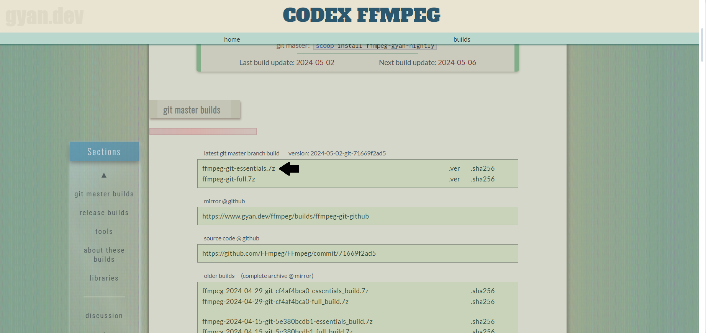
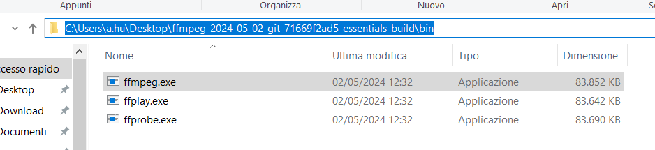
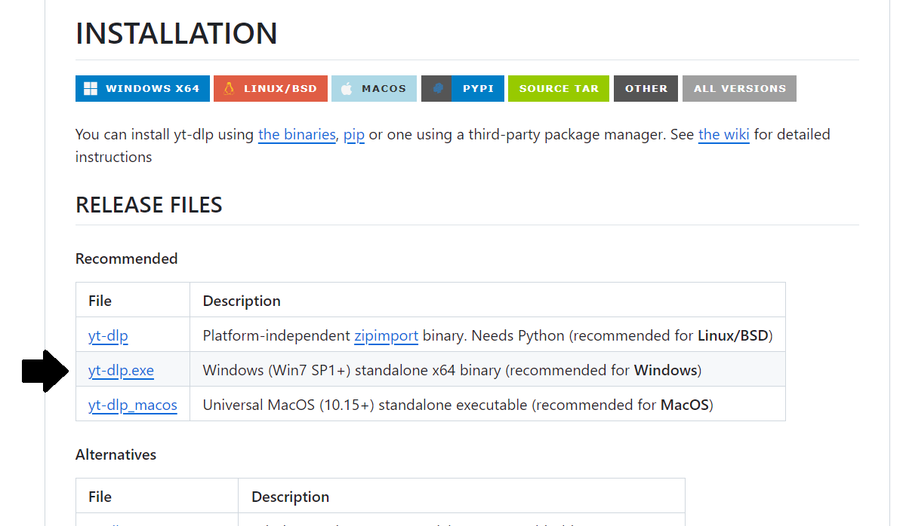
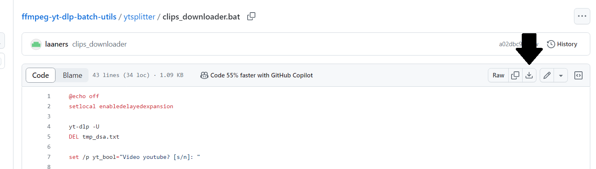

# Setup

Per prima cosa creare una cartella dove dentro terremmo i programmi che scaricheremo, lo script per tagliare i clip e i clip che verranno tagliati verranno salvati qui. Mi riferirò a questa cartella come ```ffolder``` in seguito

## Cose da scaricare

### ffmpeg

Scaricare [qui](https://www.gyan.dev/ffmpeg/builds/) ```ffmpeg-git-essentials.7z```



Decomprimere il file scaricato, andare nella cartella ```bin``` e spostare il file ```ffmpeg.exe``` in ```ffolder```



Tutto il resto si può cestinare


### yt-dlp
Scaricare [qui](https://github.com/yt-dlp/yt-dlp?tab=readme-ov-file#release-files) ```yt-dlp.exe```



Spostare il file ```yt-dlp.exe``` in ```ffolder```

### clips_downloader

Scaricare [qui](https://github.com/laaners/ffmpeg-yt-dlp-batch-utils/blob/master/ytsplitter/ytsplitter.bat) ```ytsplitter.bat```



Spostare il file ```ytsplitter.bat``` in ```ffolder```

# Clippare

```
```
## Batches:
### frames
```bash
# Create a frames folder containing all frames of the video
C:\folder>frames "video"
```
### joiner
```bash
# Uses -f concat -safe to join all the videos/audios in the selected folder, default extension .mp4
C:\folder>joiner "folder_name" [.ext]
```
### joinersubdiv
```bash
# In a folder with various subfolders of the beforementioned kind, joins all videos/audios of subfolders creating videos/audios for each subfolders
C:\folder_with_subfolders>joinersubdiv
```
### splitter
```bash
# Cuts a video file according to timestamps specified in a .txt file, splitter -h for more info
C:\folder>splitter -h

# Spawns 0 parallel processes and cuts video.mp4 according to timestamps in splitter.txt, timestamps specified in [hh:]mm:ss-[hh:]mm:ss or in ss.ms-ss.ms, with -c copy
C:\folder>splitter -r 0 "video.mp4" splitter.txt

# Spawns 2 parallel processes and cuts video.mp4 according to timestamps in splitter.txt, with -preset veryfast, -c:v libx264 and -c:a aac
C:\folder>splitter -p 2 "video.mp4" splitter.txt veryfast
```
### silencer
Requires the beforementioned splitter and joiner
```bash
# Removes all video parts with audio below a certain threshold, needs splitter and joiner in path, silencer -h for more info
C:\folder>silencer -h

# Removes all moments with audio below -10dB and duration of at least 2 seconds, traslating the removing startpoint 0.5 seconds before the original startpoint the removing endpoint 0.7 seconds after the original endpoint
C:\folder>silencer -t "video.mp4" -10dB 2 0.6-0.7
```
### timesum
```bash
# Sums all times or timestamps in a .txt file, timesum -h for more info
C:\folder>timesum -h
```
### ytsplitter
```bash
# Downloads directly the clips specified by a .txt file from a downloadable video with yt-dlp, timestamps specified in [hh:]mm:ss-[hh:]mm:ss
C:\folder>ytsplitter "video_url" "timestamps.txt"
```
### zaria2c
```bash
# Downloads file with aria2c by specifying only yt-dlp options
C:\folder>zaria2c "-f 248+140 video_url"
```
### elgato
```bash
# Batch for elgato 60HD recording/streaming, elgato -h for more info
C:\folder>elgato -h
```
