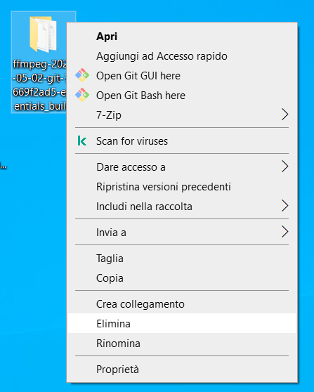

<!-- TOC -->

- [Setup](#setup)
    - [Cose da scaricare](#cose-da-scaricare)
        - [ffmpeg](#ffmpeg)
        - [yt-dlp](#yt-dlp)
        - [clips_downloader](#clips_downloader)
    - [ffolder](#ffolder)
- [Clippare](#clippare)
    - [File splitter.txt](#file-splittertxt)
    - [Scegliere il formato](#scegliere-il-formato)
    - [Clips generati](#clips-generati)
- [Considerazioni](#considerazioni)

# Setup

Per prima cosa creare una cartella dove dentro terremmo i programmi che scaricheremo, lo script per tagliare le clip e le clip che verranno tagliati. Mi riferirò a questa cartella come ```ffolder``` in seguito

## Cose da scaricare

### ffmpeg

Scaricare [qui](https://www.gyan.dev/ffmpeg/builds/) ```ffmpeg-git-essentials.7z```


Decomprimere il file scaricato, andare nella cartella ```bin``` e spostare il file ```ffmpeg.exe``` in ```ffolder```


Tutto il resto si può cestinare



### yt-dlp
Scaricare [qui](https://github.com/yt-dlp/yt-dlp?tab=readme-ov-file#release-files) ```yt-dlp.exe```


Spostare il file ```yt-dlp.exe``` in ```ffolder```

### clips_downloader

Scaricare [qui](https://github.com/laaners/ffmpeg-yt-dlp-batch-utils/blob/ytsplitter/ytsplitter/clips_downloader.bat) ```clips_downloader.bat```


Spostare il file ```ytsplitter.bat``` in ```ffolder```

## ffolder

Alla fine del setup la cartella ```ffolder``` deve contenere le seguenti cose:


# Clippare

## File ```splitter.txt```

Creare un file ```.txt``` che si chiami esattamente ```splitter.txt``` sempre dentro ```ffolder```. Dentro vanno specificati i timestamp con l'inizio e la fine delle clip da estrarre, messi in riga uno sotto l'altro senza nessun altro commento.

Un esempio:
```
0:20:40-0:20:51
0:41:15-0:41:38
1:00:40-1:01:05
1:02:04-1:02:23
1:02:48-1:03:00
1:12:47-1:13:24
1:48:07-1:48:32
1:53:14-1:53:36
2:32:56-2:33:17
2:44:18-2:45:00
2:47:51-2:48:14
3:19:18-3:19:50
3:27:15-3:27:50
```

Altri formati accettabili sono i seguenti (questi timestamp sono tutti equivalenti):
```
122-132
0122-0:02:12
2:02-132
0:02:02-0:02:12
00:02:02-132
```

## Scegliere il formato

Una volta decisi i timestamp delle clip, fare doppio click su ```clips_downloader.bat```.

Bisogna innanzitutto dire allo script se si tratta di un video da youtube o no digitando il tasto ```s``` sulla tastiera se si.  

Incollare quindi l'url del video (con ```ctrl+v``` o semplicemento tasto destro) e premere invio. url da youtube possono essere per esempio del tipo:

https://www.youtube.com/watch?v=LXb3EKWsInQ

https://youtu.be/LXb3EKWsInQ?feature=shared

Dopo qualche secondo, verranno proposti diversi formati, in base a quelli disponibili sul web. Per esempio dall'url precedente otteniamo:
```
Latest version: stable@2024.04.09 from yt-dlp/yt-dlp
yt-dlp is up to date (stable@2024.04.09 from yt-dlp/yt-dlp)
Could Not Find C:\Users\kirby\OneDrive\Desktop\ffolder\tmp_dsa.txt
Video youtube? [s/n]: s

Incolla l'url del video: https://youtu.be/LXb3EKWsInQ?feature=shared
[youtube] Extracting URL: https://youtu.be/LXb3EKWsInQ?feature=shared
[youtube] LXb3EKWsInQ: Downloading webpage
[youtube] LXb3EKWsInQ: Downloading ios player API JSON
[youtube] LXb3EKWsInQ: Downloading android player API JSON
WARNING: [youtube] Skipping player responses from android clients (got player responses for video "aQvGIIdgFDM" instead of "LXb3EKWsInQ")
[youtube] LXb3EKWsInQ: Downloading m3u8 information
[info] Available formats for LXb3EKWsInQ:
ID      EXT   RESOLUTION FPS HDR CH │   FILESIZE    TBR PROTO │ VCODEC           VBR ACODEC      ABR ASR MORE INFO
───────────────────────────────────────────────────────────────────────────────────────────────────────────────────────────────
sb3     mhtml 48x27        0        │                   mhtml │ images                                   storyboard
sb2     mhtml 80x45        0        │                   mhtml │ images                                   storyboard
sb1     mhtml 160x90       0        │                   mhtml │ images                                   storyboard
sb0     mhtml 320x180      0        │                   mhtml │ images                                   storyboard
233     mp4   audio only            │                   m3u8  │ audio only           unknown             Default
234     mp4   audio only            │                   m3u8  │ audio only           unknown             Default
139-drc m4a   audio only          2 │    1.83MiB    49k https │ audio only           mp4a.40.5   49k 22k low, DRC, m4a_dash
139     m4a   audio only          2 │    1.83MiB    49k https │ audio only           mp4a.40.5   49k 22k low, m4a_dash
249     webm  audio only          2 │    1.88MiB    50k https │ audio only           opus        50k 48k low, webm_dash
250     webm  audio only          2 │    2.51MiB    67k https │ audio only           opus        67k 48k low, webm_dash
140-drc m4a   audio only          2 │    4.84MiB   129k https │ audio only           mp4a.40.2  129k 44k medium, DRC, m4a_dash
140     m4a   audio only          2 │    4.84MiB   129k https │ audio only           mp4a.40.2  129k 44k medium, m4a_dash
251     webm  audio only          2 │    4.96MiB   133k https │ audio only           opus       133k 48k medium, webm_dash
602     mp4   256x144     15        │ ~  3.27MiB    87k m3u8  │ vp09.00.10.08    87k video only
269     mp4   256x144     30        │ ~  6.39MiB   171k m3u8  │ avc1.4D400C     171k video only
160     mp4   256x144     30        │    2.69MiB    72k https │ avc1.4D400C      72k video only          144p, mp4_dash
603     mp4   256x144     30        │ ~  5.94MiB   159k m3u8  │ vp09.00.11.08   159k video only
278     webm  256x144     30        │    3.18MiB    85k https │ vp09.00.11.08    85k video only          144p, webm_dash
394     mp4   256x144     30 10     │    2.39MiB    64k https │ av01.0.00M.10    64k video only          144p HDR, mp4_dash
694     mp4   256x144     60 10     │    4.50MiB   120k https │ av01.0.00M.10   120k video only          144p60 HDR, mp4_dash
631     mp4   256x144     60 10     │ ~ 11.57MiB   309k m3u8  │ vp09.02.11.10   309k video only
330     webm  256x144     60 10     │    7.91MiB   212k https │ vp09.02.11.10   212k video only          144p60 HDR, webm_dash
229     mp4   426x240     30        │ ~ 11.61MiB   310k m3u8  │ avc1.4D4015     310k video only
133     mp4   426x240     30        │    6.00MiB   161k https │ avc1.4D4015     161k video only          240p, mp4_dash
604     mp4   426x240     30        │ ~ 10.81MiB   289k m3u8  │ vp09.00.20.08   289k video only
242     webm  426x240     30        │    6.65MiB   178k https │ vp09.00.20.08   178k video only          240p, webm_dash
395     mp4   426x240     30 10     │    4.15MiB   111k https │ av01.0.00M.10   111k video only          240p HDR, mp4_dash
695     mp4   426x240     60 10     │    9.54MiB   255k https │ av01.0.01M.10   255k video only          240p60 HDR, mp4_dash
632     mp4   426x240     60 10     │ ~ 21.62MiB   578k m3u8  │ vp09.02.21.10   578k video only
331     webm  426x240     60 10     │   16.57MiB   443k https │ vp09.02.21.10   443k video only          240p60 HDR, webm_dash
230     mp4   640x360     30        │ ~ 30.02MiB   802k m3u8  │ avc1.4D401E     802k video only
134     mp4   640x360     30        │   12.87MiB   344k https │ avc1.4D401E     344k video only          360p, mp4_dash
18      mp4   640x360     30      2 │ ≈ 17.69MiB   473k https │ avc1.42001E          mp4a.40.2       44k 360p
605     mp4   640x360     30        │ ~ 24.38MiB   651k m3u8  │ vp09.00.21.08   651k video only
243     webm  640x360     30        │   13.83MiB   370k https │ vp09.00.21.08   370k video only          360p, webm_dash
396     mp4   640x360     30 10     │    8.27MiB   221k https │ av01.0.01M.10   221k video only          360p HDR, mp4_dash
696     mp4   640x360     60 10     │   19.66MiB   526k https │ av01.0.04M.10   526k video only          360p60 HDR, mp4_dash
633     mp4   640x360     60 10     │ ~ 46.90MiB  1253k m3u8  │ vp09.02.30.10  1253k video only
332     webm  640x360     60 10     │   35.71MiB   955k https │ vp09.02.30.10   955k video only          360p60 HDR, webm_dash
231     mp4   854x480     30        │ ~ 50.66MiB  1353k m3u8  │ avc1.4D401F    1353k video only
135     mp4   854x480     30        │   21.38MiB   572k https │ avc1.4D401F     572k video only          480p, mp4_dash
606     mp4   854x480     30        │ ~ 43.30MiB  1157k m3u8  │ vp09.00.30.08  1157k video only
244     webm  854x480     30        │   25.08MiB   671k https │ vp09.00.30.08   671k video only          480p, webm_dash
397     mp4   854x480     30 10     │   15.15MiB   405k https │ av01.0.04M.10   405k video only          480p HDR, mp4_dash
697     mp4   854x480     60 10     │   36.94MiB   988k https │ av01.0.05M.10   988k video only          480p60 HDR, mp4_dash
634     mp4   854x480     60 10     │ ~ 83.33MiB  2226k m3u8  │ vp09.02.31.10  2226k video only
333     webm  854x480     60 10     │   68.92MiB  1842k https │ vp09.02.31.10  1842k video only          480p60 HDR, webm_dash
22      mp4   1280x720    30      2 │ ≈ 64.63MiB  1727k https │ avc1.64001F          mp4a.40.2       44k 720p
136     mp4   1280x720    30        │   59.79MiB  1598k https │ avc1.4d401f    1598k video only          720p, mp4_dash
247     webm  1280x720    30        │   46.96MiB  1256k https │ vp9            1256k video only          720p, webm_dash
311     mp4   1280x720    60        │ ~142.10MiB  3796k m3u8  │ avc1.4D4020    3796k video only
298     mp4   1280x720    60        │   95.63MiB  2557k https │ avc1.4D4020    2557k video only          720p60, mp4_dash
612     mp4   1280x720    60        │ ~141.55MiB  3782k m3u8  │ vp09.00.40.08  3782k video only
302     webm  1280x720    60        │   70.76MiB  1892k https │ vp09.00.40.08  1892k video only          720p60, webm_dash
398     mp4   1280x720    60 10     │   43.10MiB  1152k https │ av01.0.08M.10  1152k video only          720p60 HDR, mp4_dash
698     mp4   1280x720    60 10     │  105.72MiB  2826k https │ av01.0.08M.10  2826k video only          720p60 HDR, mp4_dash
635     mp4   1280x720    60 10     │ ~183.60MiB  4905k m3u8  │ vp09.02.40.10  4905k video only
334     webm  1280x720    60 10     │  162.04MiB  4332k https │ vp09.02.40.10  4332k video only          720p60 HDR, webm_dash
312     mp4   1920x1080   60        │ ~233.05MiB  6226k m3u8  │ avc1.64002A    6226k video only
299     mp4   1920x1080   60        │  168.04MiB  4492k https │ avc1.64002A    4492k video only          1080p60, mp4_dash
617     mp4   1920x1080   60        │ ~232.96MiB  6224k m3u8  │ vp09.00.41.08  6224k video only
303     webm  1920x1080   60        │  128.03MiB  3423k https │ vp09.00.41.08  3423k video only          1080p60, webm_dash
399     mp4   1920x1080   60 10     │   80.90MiB  2163k https │ av01.0.09M.10  2163k video only          1080p60 HDR, mp4_dash
699     mp4   1920x1080   60 10     │  172.83MiB  4621k https │ av01.0.09M.10  4621k video only          1080p60 HDR, mp4_dash
636     mp4   1920x1080   60 10     │ ~278.83MiB  7449k m3u8  │ vp09.02.41.10  7449k video only
335     webm  1920x1080   60 10     │  251.71MiB  6729k https │ vp09.02.41.10  6729k video only          1080p60 HDR, webm_dash
623     mp4   2560x1440   60        │ ~527.86MiB 14102k m3u8  │ vp09.00.50.08 14102k video only
308     webm  2560x1440   60        │  389.75MiB 10420k https │ vp09.00.50.08 10420k video only          1440p60, webm_dash
400     mp4   2560x1440   60 10     │  207.25MiB  5541k https │ av01.0.12M.10  5541k video only          1440p60 HDR, mp4_dash
700     mp4   2560x1440   60 10     │  531.30MiB 14204k https │ av01.0.12M.10 14204k video only          1440p60 HDR, mp4_dash
639     mp4   2560x1440   60 10     │ ~655.65MiB 17516k m3u8  │ vp09.02.50.10 17516k video only
336     webm  2560x1440   60 10     │  607.90MiB 16252k https │ vp09.02.50.10 16252k video only          1440p60 HDR, webm_dash
628     mp4   3840x2160   60        │ ~  1.03GiB 28176k m3u8  │ vp09.00.51.08 28176k video only
315     webm  3840x2160   60        │  954.14MiB 25508k https │ vp09.00.51.08 25508k video only          2160p60, webm_dash
401     mp4   3840x2160   60 10     │  435.51MiB 11643k https │ av01.0.13M.10 11643k video only          2160p60 HDR, mp4_dash
701     mp4   3840x2160   60 10     │  937.95MiB 25075k https │ av01.0.13M.10 25075k video only          2160p60 HDR, mp4_dash
642     mp4   3840x2160   60 10     │ ~  1.16GiB 31609k m3u8  │ vp09.02.51.10 31609k video only
337     webm  3840x2160   60 10     │    1.06GiB 28952k https │ vp09.02.51.10 28952k video only          2160p60 HDR, webm_dash

Formato del video:
```

I valori sono abbastanza autoesplicativi. Anche se alcuni formati dicono ```video_only```, le clip finali avranno comunque l'audio. Se si vuole per esempio avere le clip in risoluzione ```1920x1080``` si può scrivere in dentro ```Formato del video: ``` un numero tra i seguenti: ```[312, 299, 617, 303, 399, 699, 636, 335]```.

Per youtube si consiglia di scegliere un formato con ```mp4``` invece di ```webm```, in genere io scelgo o ```299``` o ```137``` (se appaiono).

```
...
642     mp4   3840x2160   60 10     │ ~  1.16GiB 31609k m3u8  │ vp09.02.51.10 31609k video only
337     webm  3840x2160   60 10     │    1.06GiB 28952k https │ vp09.02.51.10 28952k video only          2160p60 HDR, webm_dash

Formato del video: 299
```

Premere quindi invio e lo script inizierà a scaricare in automatico le clip e a salvarli in ```ffolder```

Un esempio con un VOD da twich:

```
Latest version: stable@2024.04.09 from yt-dlp/yt-dlp
yt-dlp is up to date (stable@2024.04.09 from yt-dlp/yt-dlp)
Could Not Find C:\Users\kirby\OneDrive\Desktop\ffolder\tmp_dsa.txt
Video youtube? [s/n]: n

Incolla l'url del video: https://www.twitch.tv/videos/2136115617
[twitch:vod] Extracting URL: https://www.twitch.tv/videos/2136115617
[twitch:vod] 2136115617: Downloading stream metadata GraphQL
[twitch:vod] 2136115617: Downloading video access token GraphQL
[twitch:vod] 2136115617: Downloading m3u8 information
[twitch:vod] 2136115617: Downloading storyboard metadata JSON
[info] Available formats for v2136115617:
ID         EXT   RESOLUTION FPS │ PROTO │ VCODEC      ACODEC    MORE INFO
──────────────────────────────────────────────────────────────────────────
sb1        mhtml 110x62       0 │ mhtml │ images                storyboard
sb0        mhtml 220x124      0 │ mhtml │ images                storyboard
Audio_Only mp4   audio only     │ m3u8  │ audio only  mp4a.40.2
160p30     mp4   284x160        │ m3u8  │ avc1.4D001E mp4a.40.2
360p30     mp4   640x360        │ m3u8  │ avc1.4D001E mp4a.40.2
480p30     mp4   852x480        │ m3u8  │ avc1.4D001F mp4a.40.2
720p60     mp4   1280x720       │ m3u8  │ avc1.4D0020 mp4a.40.2
Source     mp4   1920x1080      │ m3u8  │ avc1.64002A mp4a.40.2

Formato del video: Source

...
```

## Clips generati
Le clip generate sono file ```.mp4``` nominati secondo il timestamp iniziale, dai timestamp precedenti abbiamo per esempio:

```
122-132          ->  122.mp4
0122-0:02:12     ->  0122.mp4
2:02-132         ->  2_02.mp4
0:02:02-0:02:12  ->  0_02_02.mp4
00:02:02-132     ->  00_02_02.mp4
```


Se in ```ffolder``` esistono già dei video con quei nomi, lo script NON sovrascrive i video già presenti.

# Considerazioni

- Per terminare prima perché si è sbagliati chiudere premendo sulla X o fare ```ctrl+c```
- La velocità che lo script impiega per clippare varia dal sito in cui è hostato il video, ma in genere non impiega più del doppio del tempo: testando, per una clip di ```30s``` a qualità ```1920x1080``` sul mio pc impiega circa ```30/1.3 = 23s``` se da youtube e ```30/0.7 = 42s``` se da twitch
- Visto che le clip non vengono sovrascritti, si può far partire più copie del programma in parallelo, facendo doppio clip su ```clips_downloader.bat``` anche quando ce n'è già uno aperto. Se se ne aprono due, non necessariamente ci si impiega la metà del tempo, ma se sul pc girano pochi programmi in quel momento le clip vengono scaricati comunque più velocemente con più copie dello script aperto